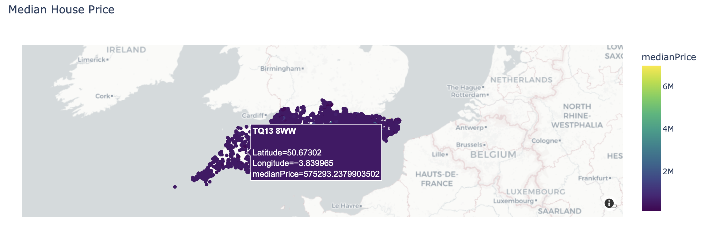
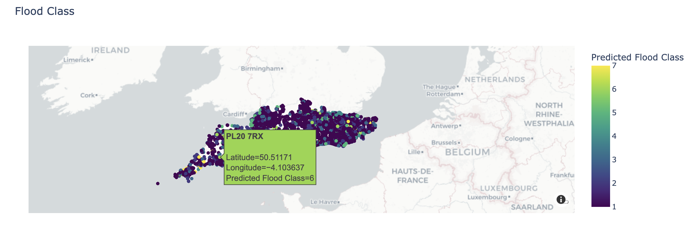

# Flood Risk Prediction tool

## Deadlines
-  **Code: 12pm GMT Friday 22th November 2024**
-  **Presentation and one-page report: 4pm GMT Friday 22th November 2024**

You should update this document in the course of your work to reflect the scope and abilities of your project, as well as to provide appropriate instuctions to potential users (and markers) of your code.

### Key Requirements

Your project must provide the following:

 1. at least one analysis method to estimate a number of attributes for unlabelled postcodes extrapolated from sample data which is provided to you:
    - Flood risk from rivers & seas (on a 10 point scale).
    - Flood risk from surface water (on a 10 point scale).
    - Median house price.
 2. at least one analysis method to estimate the Local Authority & flood risks of arbitrary locations. 
 3. a process to find the rainfall and water level near a given postcode from provided rainfall, river and tide level data, or by looking online.
 4. visualization and analysis tools for the postcode, rainfall, river & tide data provided to you, ideally in a way which will identify potential areas at immediate risk of flooding by combining the data you have been given.
 
 Your code should have installation instructions and basic documentation, as docstrings for functions & class methods, as a full manual or ideally both.


This README file *should be updated* over the course of your group's work to represent the scope and abilities of your project.

### Assessment

 - Your code will be assessed for its speed (both at training and prediction) & predictive accuracy.
 - Your code should include tests of its functionality.
 - Additional marks will be awarded for maintaining good code quality and for a clean, well-organised repository. You should consider the kind of code you would be happy to take over from another group of students.

### AI usage

- [Chatgpt Plotly Map](https://chatgpt.com/share/67405614-7250-800f-a6d2-9d26ba2403fb) - This is used to get insights on Plotly Map.

- [Chatgpt Encoding Fix](https://chatgpt.com/share/674063c1-ad30-800d-a857-ebb2fe89dfe6) - This is used in debugging and concepts clarification on oversampling when construcing the historic_flood model.

- [Chatgpt Git Conflict Resolution](https://chatgpt.com/share/67405e17-7298-800d-8468-2916b60582ac)

- [Chatgpt RandomForest overfitting](https://chatgpt.com/share/67405e58-0d6c-800d-9635-c324411353bb)

- [Chatgpt Risk Label](https://chatgpt.com/share/6740732c-1a4c-800d-a981-72a5bf05924f) - This is used in debugging and some of our codes are inspired by.

- [Chatgpt Git](https://chatgpt.com/share/67408c2e-8a58-8013-888b-e2b67396af98) - Fixing erros in Github console.

- [Chatgpt Fixing Overfitting](https://chatgpt.com/share/67408d0c-0ca0-8013-a65b-bc7e61496221) - This is to fix overfitting when constructing median house prices.


### Software Installation Guide

**Prerequisite**

**Ensure Python3 is installed on your machine**

```bash
python3 --version
```

This project uses Conda as a package manager for managing software packages, dependencies and environments. You should have conda configured on your local machine before installing the project.
You can check if Conda is installed by running:

```bash
conda -V
```

We will now use Miniconda to create the `deluge` environment. To start, we first use `git` to clone the repository containing the materials of flooding risk project.

```bash
git clone https://github.com/ese-ada-lovelace-2024/ads-deluge-exe.git
```

Navigate into the repository (e.g., cd ads-deluge-exe). Then configure the conda environment:

```bash
conda env create -f environment.yml
conda avtivate deluge
```

To deactivate the environment you can run:

```bash
conda deactivate
```

**VS Code**

You can run the code in this project interactively in VSCode or use Jupyter Notebook for example. To get started:
1. Make sure you are setting up environment correctly and in the correct file path in the terminal.
2. In VS Code, run the following command.

```bash
code .
```

### User instructions

**Risk Tool**

The tool.py file combines the main functionality of the flooding risk tool. It provides methods for working with flood data associated with UK postcode and geographic coordinates. This enables predictions for:

- Flood class
- Median house prices
- Identification of local authority
- Historic flooding

---

#### **To get started:**

The first step is to import the tool from the flood_tool module:

```python
import sys
sys.path.append('..')
import flood_tool as ft
tool = ft.Tool()
```

Run the following command to train all the models:
```python
tool.fit()
```

Now, the class is initialized, we can simply call functions from tool directly. See below for description and instruction of each function involved in this tool.py.

1. Flood risk prediction: Predict flood risk levels (with riskLabel being the target variable) for postcodes or geographic coordinates based on trained models.

#### Flood risk for postcodes: 
```python
tool.predict_flood_class_from_postcodes(postcodes=['RH16 2QE'], method = 'predicting_all_risks')
```


#### Flood risk from easting/northing: 
```python
tool.predict_flood_class_from_OSGB36_location(eastings=[535295.0], northings=[123643.0], method='predicting_risk_from_easting_northing')
```

#### Flood risk from longitude/latitude: 
```python
tool.predict_flood_class_from_WGS84_locations(longitudes=[0], latitudes=[50], method = 'predicting_risk_from_latitude_longitude')
```

2. Median house price prediction: Predicting median house prices for a collection of postcodes using Random Forest regression.
```python
tool.predict_median_house_price(postcodes=['RH16 2QE'], method = 'house_price_rf')
```

3. Local authority prediction: Predicting local authorities for a sequence of easting and northing (OSGB36 locations).
```python
tool.predict_local_authority(eastings=[535295.0], northings=[123643.0], method='local_authority')
```

4. Historic flooding prediction: predicting whether a collection of postcodes has experienced historic flooding.
```python
tool.predict_historic_flooding(postcodes=['RH16 2QE'], method='historic_flooding')
```

### Visualization

Once the packages are imported into the Data Visualization.ipynb, we then can use it to explaore/analysis the data and generating interactive plot (e.g., maps).

Follow the instructions below to understand the functionality provided.

1. Import functions from analysis.py to be able to perform EDA.
2. Import functions from mapping.py to plot predicted variables (local authority, median house prices, historic flooding and flood class). 

Examples of visualizations:

### predicting median house price:
By running the following command, we can get an example plot from model predicting median house price:
```python
mapping.plot_predict_median_house_price(df, tool)
```


and an example plot from model predicting flood class:
```python
mapping.plot_predict_flood_class(df, tool)
```


### Documentation

*This section should be updated during the week.*

The code includes a basic [Sphinx](https://www.sphinx-doc.org) documentation. On systems with Sphinx installed, this can be built by running

```bash
python -m sphinx docs html
```

then viewing the generated `index.html` file in the `html` directory in your browser.

For systems with [LaTeX](https://www.latex-project.org/get/) installed, a manual PDF can be generated by running

```bash
python -m sphinx  -b latex docs latex
```

Then follow the instructions to process the `FloodTool.tex` file in the `latex` directory in your browser.

### Testing

The tool includes several tests, which you can use to check its operation on your system. With [pytest](https://doc.pytest.org/en/latest) installed, these can be run with

```bash
python -m pytest --doctest-modules flood_tool
```

### Reading list (this can be updated as you go)

 - [A guide to coordinate systems in Great Britain](https://webarchive.nationalarchives.gov.uk/20081023180830/http://www.ordnancesurvey.co.uk/oswebsite/gps/information/coordinatesystemsinfo/guidecontents/index.html)

 - [Information on postcode validity](https://assets.publishing.service.gov.uk/government/uploads/system/uploads/attachment_data/file/283357/ILRSpecification2013_14Appendix_C_Dec2012_v1.pdf)
